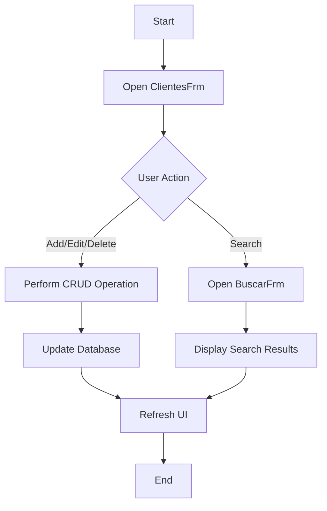

# Documentation for VB6 CRUD Application

## Purpose
The VB6 CRUD application is designed to manage customer data through a graphical user interface. It provides basic Create, Read, Update, and Delete (CRUD) operations on a database of customer records. The application is built using Visual Basic 6 (VB6) and interacts with a Microsoft Access database to store and retrieve data.

## Key Modules

1. **ClientesFrm.frm (1231 lines)**
   - This is the main form of the application, providing the user interface for managing customer data.
   - It includes controls for adding, editing, deleting, and searching customer records.
   - Handles user interactions and updates the database accordingly.

2. **CRUDMod.bas (463 lines)**
   - Contains the core logic for CRUD operations.
   - Includes functions for connecting to the database, executing SQL queries, and handling data transactions.

3. **BuscarFrm.frm (342 lines)**
   - Provides a user interface for searching customer records.
   - Allows users to input search criteria and displays matching results.

4. **TextBoxesMod.bas (312 lines)**
   - Manages the behavior and validation of text boxes within the application.
   - Ensures data integrity and proper formatting of user input.

5. **GeneralMod.bas (63 lines)**
   - Contains general utility functions used across the application.
   - May include error handling, logging, or other common tasks.

6. **HelpersMod.bas (57 lines)**
   - Provides helper functions to support the main application logic.
   - May include functions for string manipulation, date formatting, etc.

## Dependencies

- **VB6 Runtime**: The application requires the Visual Basic 6 runtime environment to execute.
- **Microsoft Access Database**: The application uses an Access database (`CRUD.mdb`) to store customer data.
- **Windows Operating System**: The application is designed to run on Windows platforms that support VB6 applications.

## Mermaid Diagrams and Flow

Below is a simplified flow diagram of the application's main processes using Mermaid syntax:

### Explanation of Flow

- **Start**: The application begins with the user opening the main form (`ClientesFrm`).
- **User Action**: The user can choose to add, edit, delete, or search for customer records.
- **Perform CRUD Operation**: Based on the user's choice, the application performs the corresponding CRUD operation.
- **Update Database**: Changes made by the user are reflected in the Access database.
- **Open BuscarFrm**: If the user opts to search, the search form (`BuscarFrm`) is opened.
- **Display Search Results**: The application displays the results of the search query.
- **Refresh UI**: After any operation, the user interface is refreshed to show the latest data.
- **End**: The process concludes, and the application waits for further user input.

This documentation provides an overview of the VB6 CRUD application, its structure, and its operational flow.