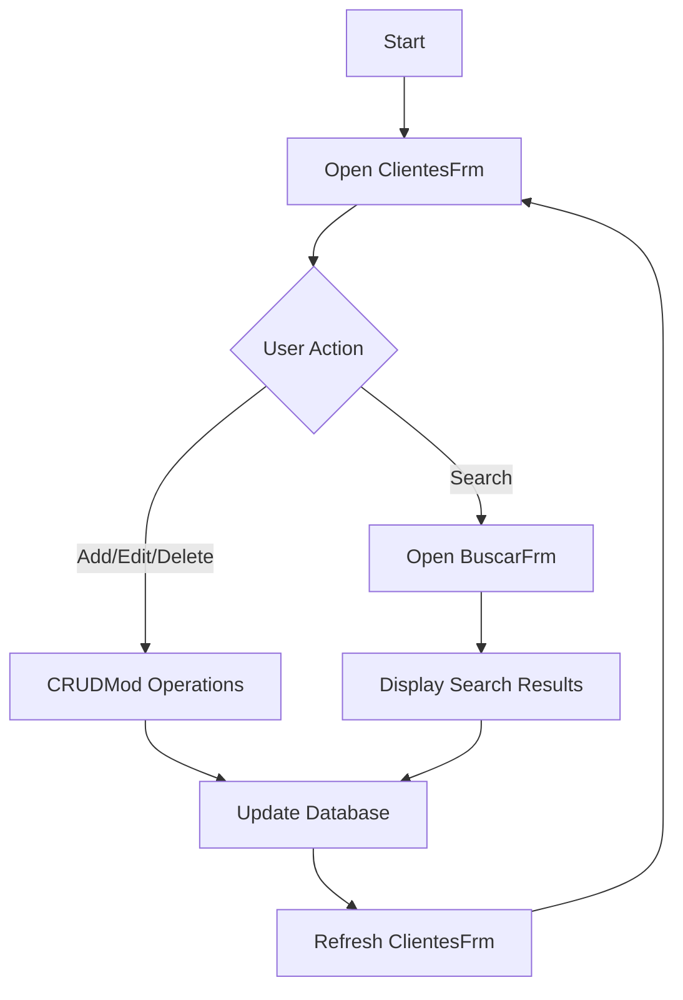
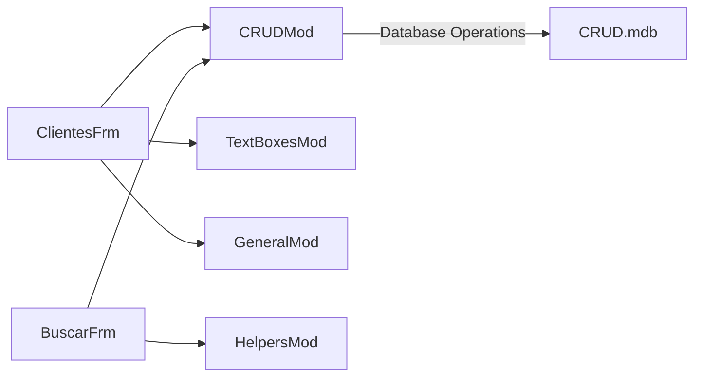

### Purpose
The project is a Visual Basic 6 (VB6) application designed to perform CRUD (Create, Read, Update, Delete) operations on a database. It provides a graphical user interface for managing client records, allowing users to search, add, edit, and delete client information stored in a Microsoft Access database.

### Key Modules

1. **ClientesFrm.frm**
   - **Purpose**: This is the main form of the application where users can interact with the client records. It provides the interface for CRUD operations.
   - **Key Features**: 
     - Display client data in a grid.
     - Buttons for adding, editing, and deleting records.
     - Navigation controls for browsing through records.

2. **CRUDMod.bas**
   - **Purpose**: Contains the core logic for performing CRUD operations on the database.
   - **Key Features**:
     - Functions for connecting to the database.
     - SQL query execution for insert, update, delete, and select operations.

3. **BuscarFrm.frm**
   - **Purpose**: A form dedicated to searching for client records.
   - **Key Features**:
     - Input fields for search criteria.
     - Display of search results.

4. **TextBoxesMod.bas**
   - **Purpose**: Provides utility functions for handling text box controls within the forms.
   - **Key Features**:
     - Validation of input data.
     - Formatting of text box content.

5. **GeneralMod.bas**
   - **Purpose**: Contains general-purpose utility functions used across the application.
   - **Key Features**:
     - Commonly used procedures and functions.

6. **HelpersMod.bas**
   - **Purpose**: Provides helper functions to support various operations in the application.
   - **Key Features**:
     - Miscellaneous utility functions.

### Dependencies

- **VB6 Runtime**: The application is built using Visual Basic 6, requiring the VB6 runtime environment to execute.
- **Microsoft Access Database**: The application interacts with a `.mdb` file, which is a Microsoft Access database, to store and retrieve client data.
- **ADO (ActiveX Data Objects)**: Used for database connectivity and operations.

### Mermaid Diagrams

#### Application Flow

#### Module Interaction

This documentation provides an overview of the VB6 CRUD application, detailing its purpose, key modules, dependencies, and interaction flow. The Mermaid diagrams illustrate the application's flow and module interactions, offering a visual representation of the system's architecture.