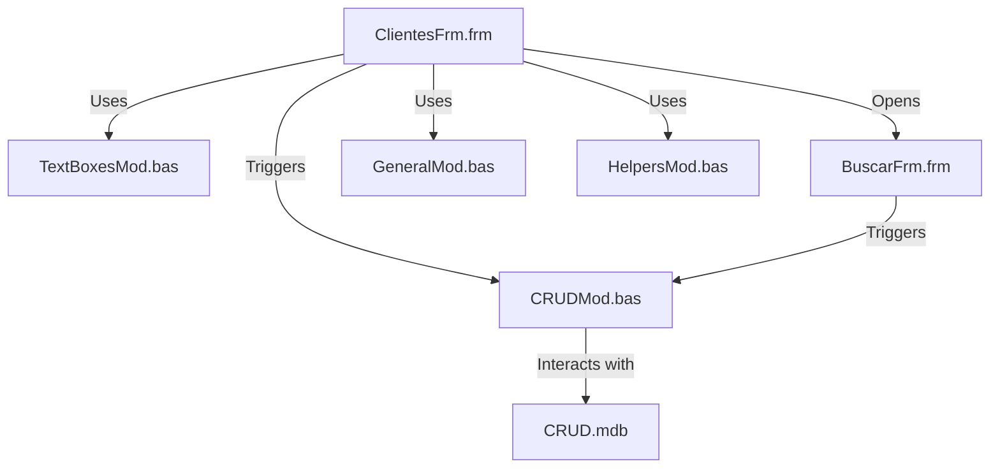

### Documentation for VB6 Form Code

#### Purpose
The VB6 application is designed to perform CRUD (Create, Read, Update, Delete) operations on a database of clients. It provides a user interface for managing client records, including searching, adding, editing, and deleting client information. The application interacts with a database (CRUD.mdb) to store and retrieve client data.

#### Key Modules
1. **ClientesFrm.frm**: 
   - This is the main form of the application, responsible for displaying and managing client records.
   - It contains the user interface elements such as text boxes, buttons, and grids for CRUD operations.
   - Handles user interactions and triggers corresponding CRUD operations.

2. **CRUDMod.bas**: 
   - Contains the core logic for performing CRUD operations on the database.
   - Includes functions for connecting to the database, executing SQL queries, and handling data transactions.

3. **BuscarFrm.frm**: 
   - A secondary form used for searching client records.
   - Provides a user interface for inputting search criteria and displaying search results.

4. **TextBoxesMod.bas**: 
   - Manages the behavior and validation of text boxes within the forms.
   - Ensures data integrity and proper formatting of user inputs.

5. **GeneralMod.bas**: 
   - Contains general utility functions used across the application.
   - May include functions for error handling, logging, or other common tasks.

6. **HelpersMod.bas**: 
   - Provides helper functions to support various operations within the application.
   - Could include functions for string manipulation, date formatting, etc.

#### Dependencies
- **Database**: The application relies on a Microsoft Access database (CRUD.mdb) to store client data.
- **VB6 Runtime**: Requires Visual Basic 6 runtime libraries to execute the application.
- **External Libraries**: May depend on additional VB6 components or ActiveX controls for UI elements.

#### Mermaid Diagram
Below is a conceptual diagram representing the interaction between the forms and modules within the application:



#### HTML and Download
To visualize the diagram, you can use the following HTML code. Save it as an HTML file and open it in a browser to view the diagram.

```html
<!DOCTYPE html>
<html lang="en">
<head>
    <meta charset="UTF-8">
    <meta name="viewport" content="width=device-width, initial-scale=1.0">
    <title>VB6 Application Diagram</title>
    <script type="module">
        import mermaid from 'https://cdn.jsdelivr.net/npm/mermaid@10/dist/mermaid.esm.min.mjs';
        mermaid.initialize({ startOnLoad: true });
    </script>
</head>
<body>
    <div class="mermaid">
        graph TD;
        A[ClientesFrm.frm] -->|Triggers| B[CRUDMod.bas]
        A -->|Uses| C[TextBoxesMod.bas]
        A -->|Opens| D[BuscarFrm.frm]
        D -->|Triggers| B
        B -->|Interacts with| E[CRUD.mdb]
        A -->|Uses| F[GeneralMod.bas]
        A -->|Uses| G[HelpersMod.bas]
    </div>
</body>
</html>
```

To download the HTML file, copy the code above into a text editor, save it with a `.html` extension, and open it in a web browser to view the diagram.