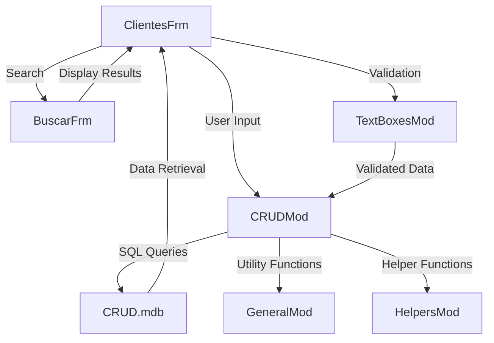

### VB6 CRUD Application Documentation

#### Purpose
The VB6 CRUD application is designed to manage basic Create, Read, Update, and Delete (CRUD) operations for a client database. It provides a user interface for interacting with client data stored in a Microsoft Access database (`CRUD.mdb`). The application is intended for users who need a simple and straightforward way to manage client information.

#### Key Modules

1. **ClientesFrm.frm**
   - **Type:** VB6 Form
   - **Lines of Code:** 1231
   - **Description:** This is the main form of the application where users can perform CRUD operations on client data. It includes UI elements such as text boxes, buttons, and grids for displaying and editing client information.

2. **CRUDMod.bas**
   - **Type:** VB6 Module
   - **Lines of Code:** 463
   - **Description:** This module contains the core logic for CRUD operations. It interfaces with the database to execute SQL queries for creating, reading, updating, and deleting client records.

3. **BuscarFrm.frm**
   - **Type:** VB6 Form
   - **Lines of Code:** 342
   - **Description:** This form provides functionality to search for specific client records. It includes search fields and displays results in a list or grid format.

4. **TextBoxesMod.bas**
   - **Type:** VB6 Module
   - **Lines of Code:** 312
   - **Description:** This module handles operations related to text boxes, such as validation and data binding. It ensures that user input is correctly formatted and validated before being processed.

5. **GeneralMod.bas**
   - **Type:** VB6 Module
   - **Lines of Code:** 63
   - **Description:** Contains general utility functions used across the application, such as error handling and common calculations.

6. **HelpersMod.bas**
   - **Type:** VB6 Module
   - **Lines of Code:** 57
   - **Description:** Provides helper functions that support various operations within the application, such as string manipulation and data conversion.

#### Dependencies

- **Microsoft Access Database (`CRUD.mdb`):** The application relies on this database to store and retrieve client data. It uses SQL queries to interact with the database.
- **VB6 Runtime:** The application requires the VB6 runtime environment to execute.
- **External Libraries:** Any additional VB6 libraries or controls used for UI components or database connectivity.

#### Mermaid Diagrams

Below is a simple Mermaid diagram representing the flow of data and interactions between the main components of the application:

This diagram illustrates the primary interactions within the application, highlighting how user input is processed and how data flows between the forms, modules, and the database.