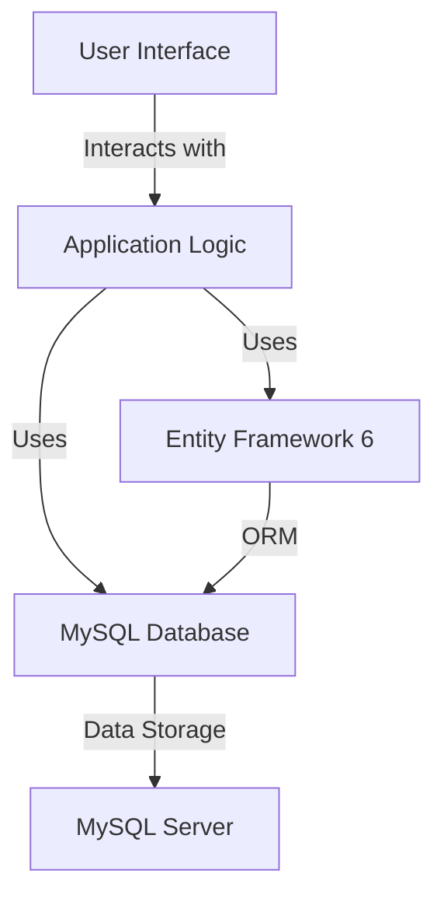

### Project Documentation for `vb-project-master`

#### Purpose
The `vb-project-master` is a Visual Basic project that appears to be a desktop application, possibly for managing a database or a similar data-driven application. The presence of MySQL-related libraries suggests that the application interacts with a MySQL database, potentially for CRUD operations or data management tasks.

#### Key Modules
1. **Database Interaction:**
   - **MySql.Data.dll**: This module is crucial for database connectivity and operations. It likely provides the necessary classes and methods to interact with a MySQL database.
   - **MySql.Data.Entity.EF6.dll**: This module suggests the use of Entity Framework 6 for ORM (Object-Relational Mapping), facilitating database operations through a more abstract, object-oriented approach.

2. **User Interface:**
   - **homepage.Designer.vb & homepage.vb**: These files define the main user interface and logic for the application's homepage.
   - **showUsers.Designer.vb & showUsers.vb**: These files are likely responsible for displaying user information within the application.
   - **customerInfo.Designer.vb & customerInfo.vb**: These files manage the user interface and logic for displaying customer information.
   - **printForm.Designer.vb**: This module is likely used for printing functionalities within the application.

3. **Resource Management:**
   - **Resources**: The project contains various image resources (e.g., `background.png`, `sidebars.png`) used for UI elements, indicating a focus on a visually appealing interface.

4. **Miscellaneous:**
   - **vbproject.vbproj**: This is the project file containing configuration and build settings for the Visual Basic project.
   - **My Project\Resources.Designer.vb**: This file manages the resources used within the project, such as images and strings.

#### Dependencies
- **MySQL Data Libraries**: The project relies on MySQL data libraries (`MySql.Data.dll`, `MySql.Data.Entity.EF6.dll`) for database operations.
- **Entity Framework 6**: The use of `MySql.Data.Entity.EF6.dll` suggests dependency on Entity Framework 6 for ORM capabilities.
- **Visual Basic Runtime**: As a VB.NET project, it requires the .NET runtime for execution.

#### Mermaid Diagrams
While the provided context does not include specific flow or architecture diagrams, a potential high-level architecture diagram could be represented as follows:

This diagram illustrates the interaction between the user interface, application logic, and the database, highlighting the role of Entity Framework in abstracting database operations.