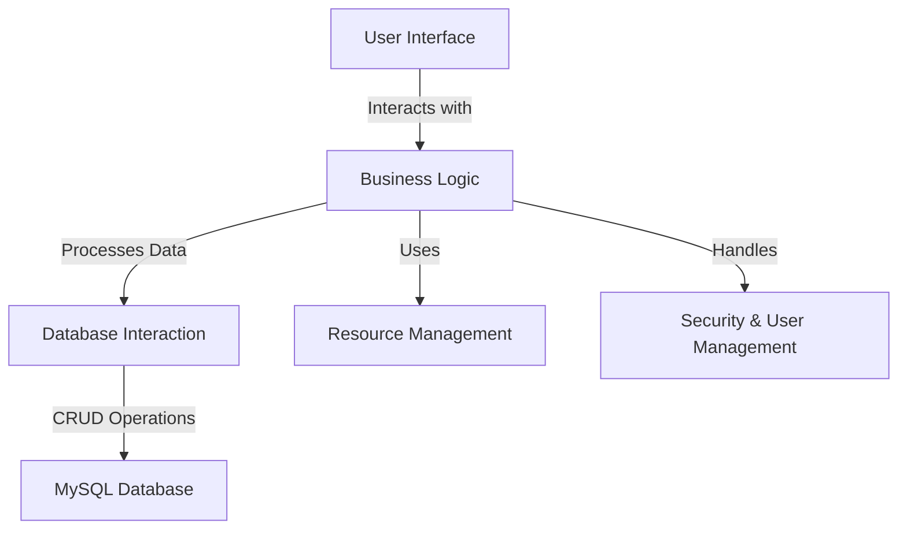

To effectively summarize the provided codebase into documentation, let's break down the key aspects:

### Purpose
The project appears to be a Visual Basic (VB.NET) application that interacts with a MySQL database. It likely serves as a management system, possibly for a hotel or similar business, given the presence of modules related to rooms, services, and customer information.

### Key Modules
1. **Database Interaction**: 
   - `MySql.Data.dll` and `MySql.Data.Entity.EF6.dll`: These DLLs are used for database connectivity and operations. They facilitate interaction with a MySQL database, likely handling CRUD operations and possibly using Entity Framework for ORM capabilities.

2. **User Interface**:
   - `homepage.Designer.vb`, `showUsers.Designer.vb`, `customerInfo.Designer.vb`, etc.: These files define the UI components of the application, such as forms for displaying and editing user and customer information.

3. **Resource Management**:
   - `Resources.Designer.vb` and associated `.resx` files: These manage application resources, such as images and other static content used in the UI.

4. **Business Logic**:
   - `homepage.vb`, `showUsers.vb`, `customerInfo.vb`: These files contain the logic for handling user interactions and processing data within the application.

5. **Security and User Management**:
   - `changepassword.Designer.vb`, `forgetform.Designer.vb`: These modules likely handle user authentication and password management.

### Dependencies
- **MySQL Connector/NET**: The application relies on MySQL.Data and MySQL.Data.Entity.EF6 for database operations.
- **Entity Framework**: Used for ORM capabilities, allowing for easier database management and interaction.
- **Visual Basic Runtime**: As a VB.NET application, it depends on the .NET Framework for execution.

### Mermaid Diagram
Below is a simplified Mermaid diagram to illustrate the high-level architecture of the application:

### Summary
This VB.NET application is structured around a typical three-tier architecture, with a focus on managing user and customer data, likely for a hospitality or service-oriented business. It leverages MySQL for data storage and retrieval, with a user-friendly interface built using Windows Forms. The application is modular, with distinct components for UI, business logic, and data access, ensuring a clear separation of concerns.