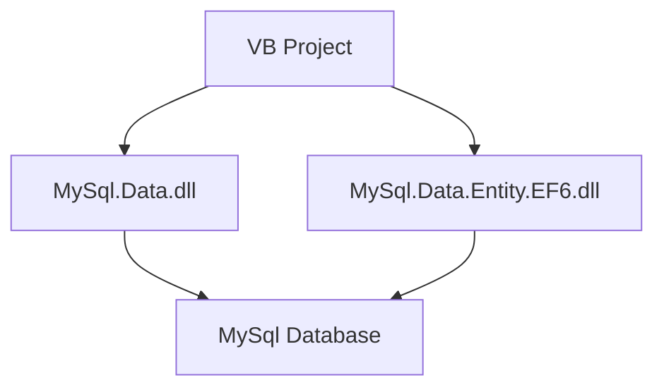

To summarize the XML code from the provided context, let's focus on the two main XML files: `MySql.Data.xml` and `MySql.Data.Entity.EF6.xml`. These files are likely documentation or configuration files related to the MySQL data access libraries used in the VB project. Here's a structured summary:

### Purpose
The XML files serve as documentation for the MySQL data access libraries used in the VB project. They likely provide metadata, configuration settings, and API documentation for the `MySql.Data` and `MySql.Data.Entity.EF6` libraries. These libraries are essential for enabling database connectivity and operations within the application.

### Key Modules
1. **MySql.Data.xml**: 
   - This file is a large XML document (10,570 lines) that likely contains comprehensive documentation for the `MySql.Data` library. This library is used for connecting to MySQL databases and performing operations such as querying, updating, and managing database connections.

2. **MySql.Data.Entity.EF6.xml**:
   - This smaller XML file (179 lines) is likely associated with the `MySql.Data.Entity.EF6` library, which provides support for Entity Framework 6, a popular ORM (Object-Relational Mapping) framework. This library facilitates database operations using an object-oriented approach, allowing developers to work with database entities as .NET objects.

### Dependencies
- **MySql.Data.dll**: This is the core library for MySQL database connectivity and operations.
- **MySql.Data.Entity.EF6.dll**: This library extends the functionality of `MySql.Data` to support Entity Framework 6, enabling ORM capabilities.

### Mermaid Diagrams
While XML files themselves do not directly translate into flowcharts or diagrams, we can conceptualize the relationship between these components using a Mermaid diagram to illustrate the dependencies and interactions:

### Additional Notes
- The XML files are located in both `Debug` and `Release` directories, indicating that they are part of the build process for different build configurations.
- The presence of `.dll` files suggests that these libraries are compiled binaries used by the VB project to interact with MySQL databases.
- The VB project includes various forms and resources, indicating a likely GUI application that interacts with a MySQL database backend.

This documentation provides a high-level overview of the XML files' purpose and their role within the VB project, focusing on database connectivity and ORM capabilities.