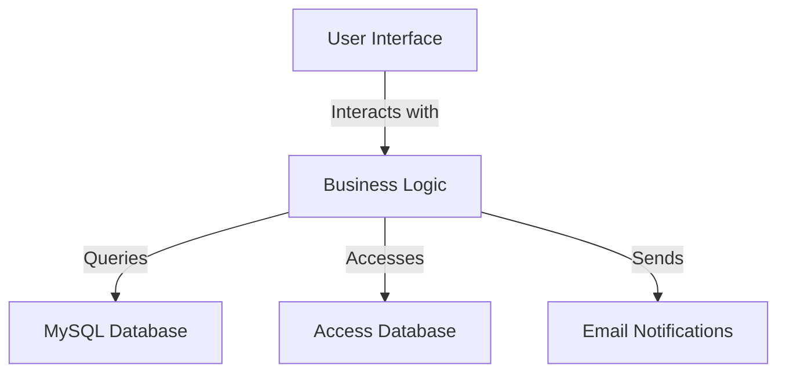

### Documentation Summary for VB Project

#### Purpose
The VB project appears to be a software application developed using Visual Basic .NET, likely for managing some form of data or operations related to users and possibly a business or service environment. The presence of database files and resource images suggests it may be a desktop application with a graphical user interface (GUI) that interacts with a database, possibly for customer or user management.

#### Key Modules
1. **Database Interaction:**
   - `MySql.Data.dll` and `MySql.Data.Entity.EF6.dll`: These are key components for database connectivity and operations, indicating the use of MySQL as the database backend.
   - `mydatabase.mdb`: Suggests the use of a Microsoft Access database, possibly for local data storage or testing.

2. **User Interface:**
   - `homepage.Designer.vb`, `showUsers.Designer.vb`, `customerInfo.Designer.vb`, etc.: These files define the design and layout of various forms within the application, indicating a GUI-based application.
   - Resource files such as `background.png`, `sidebars.png`, and other images are used for the visual elements of the application.

3. **Functionality:**
   - `homepage.vb`, `showUsers.vb`, `customerInfo.vb`: These files likely contain the logic for handling user interactions and application functionality.
   - `sendMail.Designer.vb`: Indicates functionality for sending emails, possibly for notifications or user communication.

4. **Project Configuration:**
   - `vbproject.vbproj`: The project file that contains configuration and build settings for the application.

#### Dependencies
- **MySQL Connector/NET**: The presence of `MySql.Data.dll` and `MySql.Data.Entity.EF6.dll` suggests that the application depends on MySQL Connector/NET for database operations.
- **Microsoft Access**: The `mydatabase.mdb` file indicates a dependency on Microsoft Access for database storage or operations.
- **.NET Framework**: As a VB.NET project, it inherently depends on the .NET Framework for execution.

#### Mermaid Diagrams
While the provided context does not include any Mermaid diagrams, a potential diagram could illustrate the architecture of the application, showing the interaction between the user interface, business logic, and database components. Below is a conceptual example:

This diagram represents a high-level overview of how the different components of the application might interact with each other.