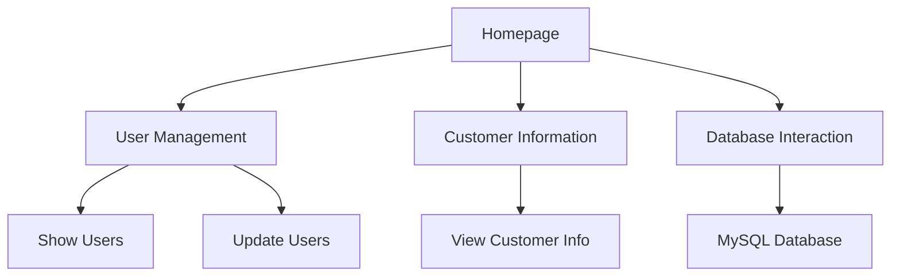
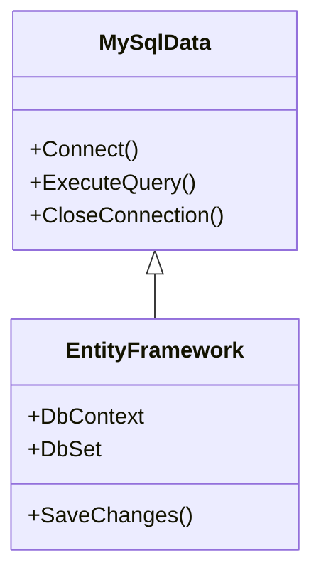

### Purpose

The project appears to be a Visual Basic (VB.NET) application that interacts with a MySQL database. The application likely serves as a user interface for managing data stored in the database, possibly for a business or organizational context. The presence of forms like `homepage`, `showUsers`, `customerInfo`, and `updateUsers` suggests functionalities related to user management and data display.

### Key Modules

1. **Homepage Module**
   - Files: `homepage.Designer.vb`, `homepage.vb`
   - Purpose: Likely serves as the main entry point or dashboard for the application, providing navigation to other functionalities.

2. **User Management Module**
   - Files: `showUsers.Designer.vb`, `showUsers.vb`, `updateUsers.Designer.vb`
   - Purpose: Manages user data, including displaying user information and updating user records.

3. **Customer Information Module**
   - Files: `customerInfo.Designer.vb`, `customerInfo.vb`
   - Purpose: Handles customer-related data, possibly for viewing and editing customer information.

4. **Database Interaction**
   - Files: `MySql.Data.dll`, `MySql.Data.Entity.EF6.dll`
   - Purpose: Facilitates interaction with a MySQL database, likely using Entity Framework 6 for ORM capabilities.

5. **Resource Management**
   - Files: `Resources.Designer.vb`, various image files
   - Purpose: Manages application resources such as images and other static content used in the UI.

### Dependencies

- **MySQL Data Connector**: The application relies on `MySql.Data.dll` and `MySql.Data.Entity.EF6.dll` for database connectivity and ORM functionality.
- **Entity Framework 6**: Used for object-relational mapping to interact with the MySQL database.
- **Visual Basic Runtime**: As a VB.NET application, it requires the .NET runtime environment.

### Mermaid Diagrams

#### Application Structure

#### Database Interaction

This documentation provides a high-level overview of the application's purpose, key modules, dependencies, and structure. The Mermaid diagrams illustrate the application's architecture and database interaction flow.