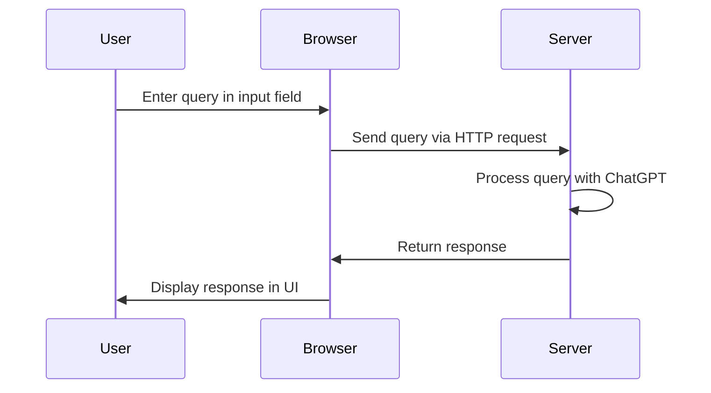

# Documentation for `index.html`

## Purpose
The `index.html` file serves as the main entry point for the user interface of the ChatGPT Java Starter application. It provides the structure and layout for the web page that users interact with. This HTML file is responsible for rendering the front-end of the application, allowing users to input text and receive responses from the ChatGPT model.

## Key Modules
1. **HTML Structure**: Defines the basic structure of the web page, including the head and body sections.
   - **Head Section**: Contains metadata, title, and links to stylesheets or scripts.
   - **Body Section**: Includes the main content of the page, such as input fields, buttons, and display areas for chat interactions.

2. **User Interface Elements**:
   - **Input Field**: Allows users to enter text queries.
   - **Submit Button**: Triggers the submission of the user's query to the backend.
   - **Response Display Area**: Shows the response from the ChatGPT model.

3. **Scripts and Styles**: May include links to external JavaScript files or CSS stylesheets to enhance functionality and appearance.

## Dependencies
- **JavaScript**: If the HTML file includes any `<script>` tags, it may depend on JavaScript for handling user interactions, such as sending requests to the server and updating the UI with responses.
- **CSS**: Any `<link>` tags pointing to stylesheets indicate a dependency on CSS for styling the web page.
- **Backend Integration**: The HTML file is likely integrated with a backend service (e.g., `ChatController.java`) to handle user inputs and provide responses from the ChatGPT model.

## Mermaid Diagrams
A simple sequence diagram can illustrate the interaction between the user interface and the backend service:

This diagram shows the flow of data from the user input to the server processing and back to the user interface, highlighting the interaction between the front-end and back-end components of the application.