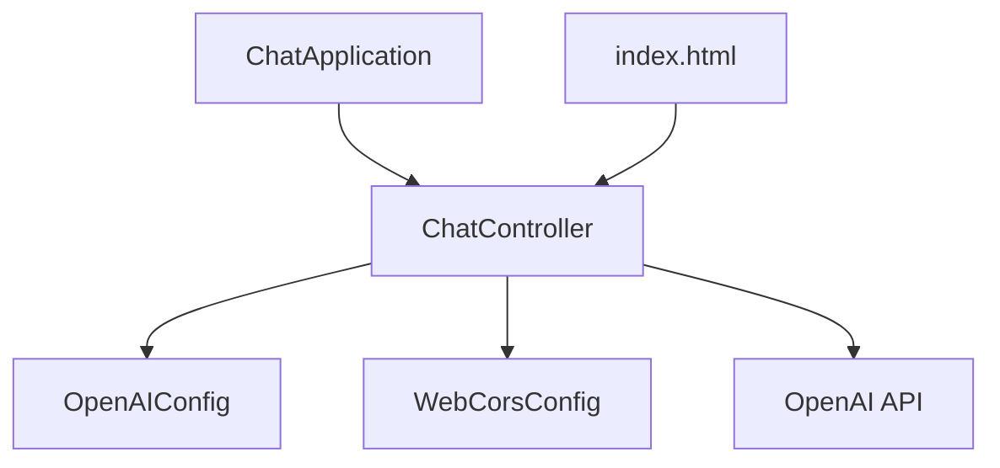

# ChatGPT Java Starter Documentation

## Purpose
The ChatGPT Java Starter project is designed to provide a basic template for integrating OpenAI's ChatGPT API into a Java-based web application. It serves as a starting point for developers who want to build applications that leverage conversational AI capabilities.

## Key Modules

### 1. `ChatApplication.java`
- **Purpose**: This is the main entry point of the Spring Boot application. It initializes and runs the application.
- **Key Functionality**: Contains the `main` method which bootstraps the Spring Boot application.

### 2. `ChatController.java`
- **Purpose**: Acts as the REST controller for handling HTTP requests related to chat functionalities.
- **Key Functionality**: 
  - Defines endpoints for interacting with the ChatGPT API.
  - Manages the flow of data between the client and the OpenAI service.

### 3. `WebCorsConfig.java`
- **Purpose**: Configures Cross-Origin Resource Sharing (CORS) settings for the application.
- **Key Functionality**: 
  - Allows or restricts resources to be requested from another domain outside the domain from which the first resource was served.

### 4. `OpenAIConfig.java`
- **Purpose**: Manages configuration settings specific to the OpenAI API.
- **Key Functionality**: 
  - Stores API keys and other configuration details necessary for authenticating and interacting with the OpenAI service.

## Dependencies

### `pom.xml`
- **Purpose**: Manages project dependencies and build configurations using Maven.
- **Key Dependencies**:
  - Spring Boot Starter Web: For building web applications.
  - Spring Boot Starter Test: For testing purposes.
  - Any additional dependencies required for OpenAI API integration.

## Additional Resources

### `index.html`
- **Purpose**: Provides a basic HTML interface for interacting with the chat application.
- **Key Functionality**: 
  - Serves as the front-end interface for users to send and receive messages.

### `application.properties`
- **Purpose**: Contains configuration properties for the Spring Boot application.
- **Key Properties**: 
  - Server port, OpenAI API keys, and other environment-specific settings.

### `.gitignore`
- **Purpose**: Specifies files and directories to be ignored by Git version control.
- **Key Entries**: 
  - Target directory, compiled classes, and other temporary files.

## Mermaid Diagrams

### Application Structure

- **Explanation**: 
  - `ChatApplication` initializes the application and links to `ChatController`.
  - `ChatController` interacts with `OpenAIConfig` for configuration and `WebCorsConfig` for CORS settings.
  - `ChatController` communicates with the `OpenAI API`.
  - `index.html` serves as the user interface connecting to `ChatController`.

This documentation provides an overview of the ChatGPT Java Starter project, detailing its purpose, key modules, dependencies, and a visual representation of its structure.