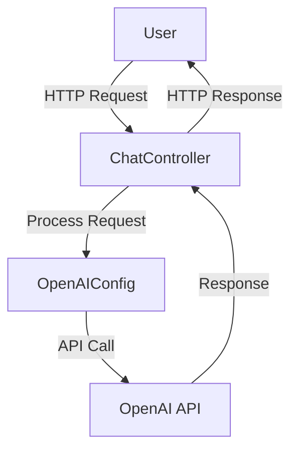
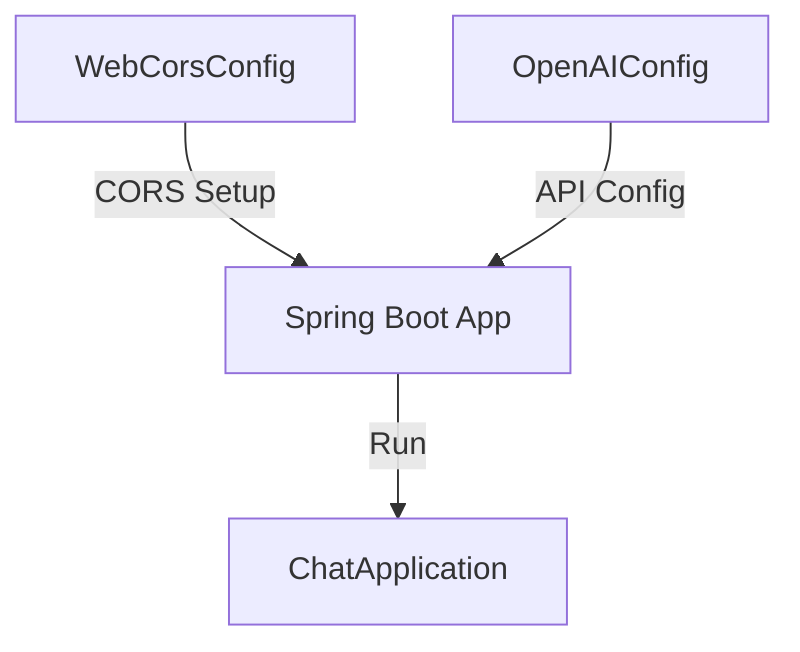

# Documentation for ChatGPT Java Starter Project

## Purpose
The ChatGPT Java Starter project is designed to provide a foundational setup for integrating OpenAI's ChatGPT API into a Java-based web application. It serves as a starting point for developers looking to build applications that leverage the capabilities of ChatGPT for conversational AI.

## Key Modules

1. **ChatController.java**
   - This module acts as the main controller for handling chat-related requests. It likely contains endpoints for sending and receiving messages to and from the ChatGPT API.

2. **WebCorsConfig.java**
   - This module is responsible for configuring Cross-Origin Resource Sharing (CORS) settings. It ensures that the web application can interact with resources from different origins, which is essential for API communication.

3. **OpenAIConfig.java**
   - This module handles the configuration settings required to connect to the OpenAI API. It likely includes API keys and endpoint configurations necessary for authentication and communication with the ChatGPT service.

4. **ChatApplication.java**
   - This is the main entry point of the application. It initializes and runs the Spring Boot application, setting up the necessary context for the application to function.

## Dependencies

- **Spring Boot**: The project is built using the Spring Boot framework, which simplifies the setup and development of Java web applications.
- **OpenAI API**: The application integrates with the OpenAI API to utilize ChatGPT's capabilities. This requires appropriate API keys and configuration settings.
- **Maven**: The project uses Maven for dependency management and build automation, as indicated by the presence of the `pom.xml` file.

## Mermaid Diagrams

### Application Architecture

### Configuration Flow

This documentation provides an overview of the ChatGPT Java Starter project, highlighting its purpose, key modules, dependencies, and architecture through Mermaid diagrams. This should help developers understand the structure and functionality of the application.