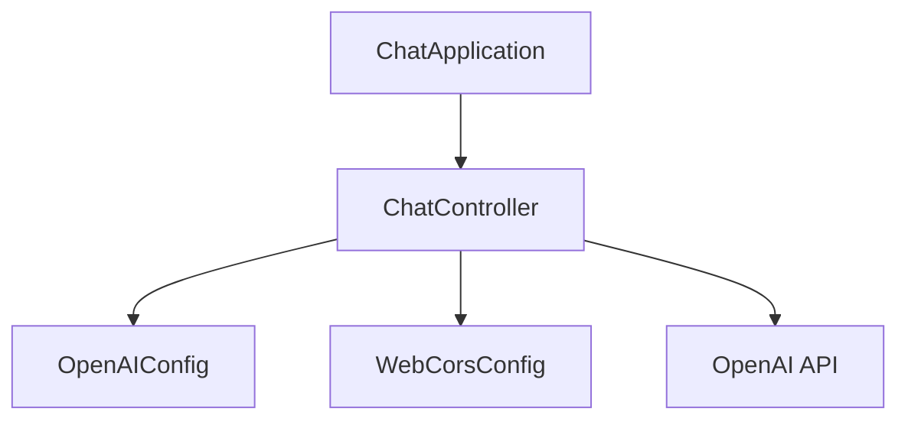
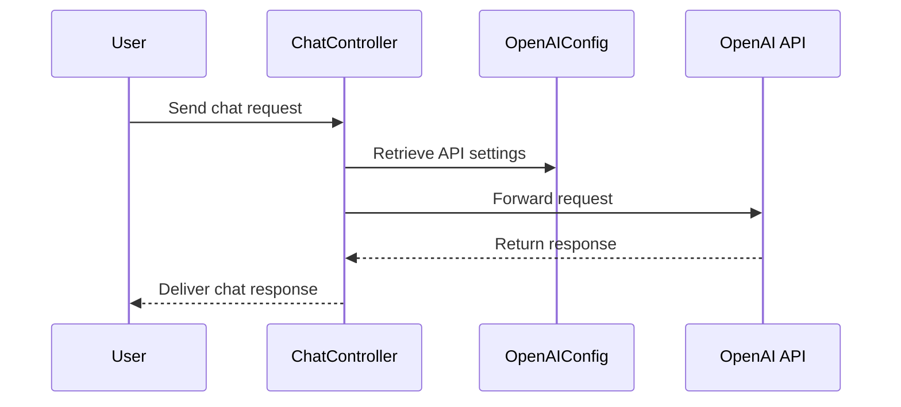

# ChatGPT Java Starter Documentation

## Purpose
The ChatGPT Java Starter project is a basic template designed to facilitate the integration of OpenAI's ChatGPT API into a Java-based web application. It provides a simple setup to quickly get started with building applications that leverage conversational AI capabilities.

## Key Modules

1. **ChatController.java**
   - **Purpose:** Acts as the main controller for handling HTTP requests related to chat functionality. It processes incoming requests, interacts with the OpenAI API, and returns responses.
   - **Key Functions:** Handles endpoints for chat interactions, manages request and response data.

2. **WebCorsConfig.java**
   - **Purpose:** Configures Cross-Origin Resource Sharing (CORS) settings for the application, allowing or restricting resources to be requested from another domain.
   - **Key Functions:** Sets up CORS mappings to ensure the application can be accessed from different origins as needed.

3. **OpenAIConfig.java**
   - **Purpose:** Manages configuration settings related to the OpenAI API, such as API keys and endpoint URLs.
   - **Key Functions:** Provides configuration properties and initializes necessary settings for API interaction.

4. **ChatApplication.java**
   - **Purpose:** Serves as the entry point for the Spring Boot application.
   - **Key Functions:** Contains the `main` method to launch the application.

## Dependencies

- **Spring Boot:** Provides the framework for building and running the Java web application.
- **OpenAI API:** The external API service used for generating chat responses.
- **Maven:** Used for project management and build automation, specified in `pom.xml`.

## Mermaid Diagrams

### Application Structure

### Request Flow

## Additional Files

- **index.html:** The frontend interface for interacting with the chat application.
- **pom.xml:** Maven configuration file specifying project dependencies and build settings.
- **README.md:** Provides an overview and setup instructions for the project.
- **.gitignore:** Lists files and directories to be ignored by Git.
- **application.properties:** Contains application-specific properties and configuration settings.