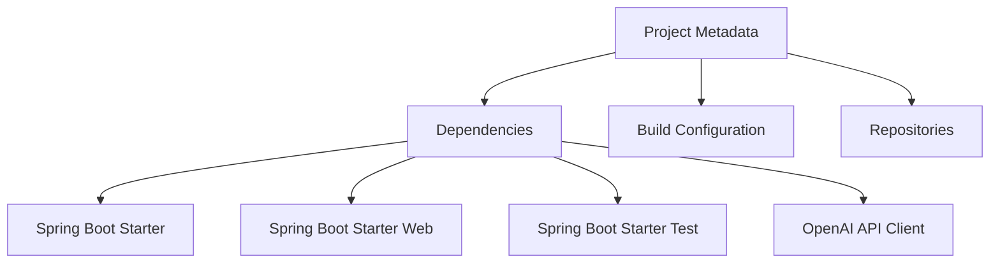

# XML Code Documentation for `pom.xml`

## Purpose
The `pom.xml` file is a Project Object Model (POM) file used by Apache Maven to manage the build, dependencies, and project configuration for the `chatgpt-java-starter` application. It defines the project's metadata, dependencies, build settings, and plugins necessary for compiling and packaging the Java application.

## Key Modules
1. **Project Metadata**: Contains basic information about the project such as the group ID, artifact ID, and version, which uniquely identify the project in a Maven repository.
2. **Dependencies**: Lists all external libraries and modules required by the project. These dependencies are automatically downloaded and included in the build process by Maven.
3. **Build Configuration**: Specifies the build plugins and settings that control how the project is compiled, tested, and packaged.
4. **Repositories**: Defines remote repositories where Maven can search for dependencies not found in the central repository.

## Dependencies
The `pom.xml` file typically includes dependencies such as:
- **Spring Boot Starter**: Provides the core functionalities of Spring Boot for building Java applications.
- **Spring Boot Starter Web**: Facilitates the development of web applications, including RESTful services.
- **Spring Boot Starter Test**: Provides testing libraries and frameworks for unit and integration testing.
- **OpenAI API Client**: If applicable, this would be a dependency for interacting with OpenAI's API.

## Mermaid Diagram
A simple dependency diagram can be represented using Mermaid syntax to visualize the relationships between the main components:

This diagram illustrates the core components of the `pom.xml` file, showing how the project metadata connects to dependencies, build configuration, and repositories. The dependencies further break down into specific libraries used in the project.