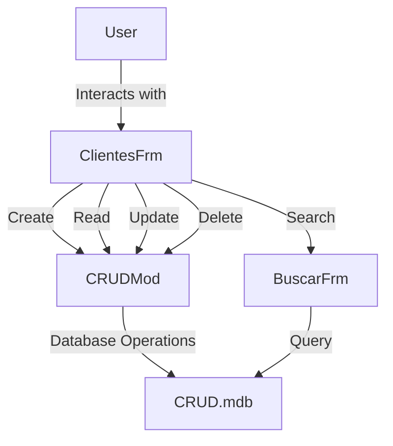

# Documentation for VB6 CRUD Application

## Purpose
The VB6 CRUD application is designed to manage basic Create, Read, Update, and Delete (CRUD) operations for a database of clients. It provides a graphical user interface (GUI) for users to interact with the database, allowing them to perform various operations on client records.

## Key Modules

1. **ClientesFrm.frm**
   - **Type:** VB6 Form
   - **Lines of Code:** 1231
   - **Description:** This is the main form of the application where users can interact with the client records. It provides the interface for CRUD operations and displays the list of clients.

2. **CRUDMod.bas**
   - **Type:** VB6 Module
   - **Lines of Code:** 463
   - **Description:** This module contains the core logic for performing CRUD operations. It handles database connections, queries, and updates to the client records.

3. **BuscarFrm.frm**
   - **Type:** VB6 Form
   - **Lines of Code:** 342
   - **Description:** This form is used for searching client records. It provides a user interface for inputting search criteria and displays the search results.

4. **TextBoxesMod.bas**
   - **Type:** VB6 Module
   - **Lines of Code:** 312
   - **Description:** This module manages the text box controls within the application, handling input validation and data binding.

5. **GeneralMod.bas**
   - **Type:** VB6 Module
   - **Lines of Code:** 63
   - **Description:** Contains general utility functions used throughout the application, such as string manipulation and error handling.

6. **HelpersMod.bas**
   - **Type:** VB6 Module
   - **Lines of Code:** 57
   - **Description:** Provides helper functions to support the main application logic, including auxiliary operations that assist in CRUD processes.

## Dependencies

- **CRUD.exe:** The compiled executable of the application.
- **CRUD.mdb:** The Microsoft Access database file used to store client records.
- **VB6 Runtime:** The application requires the Visual Basic 6 runtime environment to execute.

## Mermaid Diagrams

While the provided context does not include specific Mermaid diagrams, a potential diagram could illustrate the flow of CRUD operations within the application. Below is a conceptual flowchart in Mermaid syntax:

This diagram represents the interaction between the user, the main form, the CRUD module, and the database, illustrating how different operations are processed within the application.