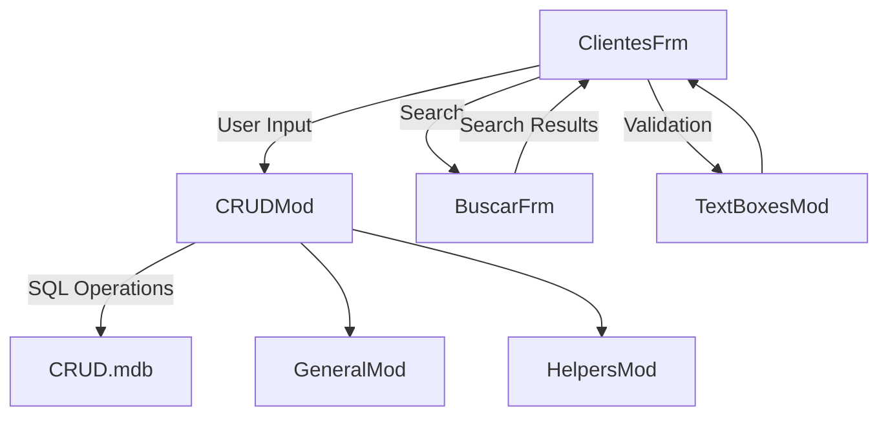
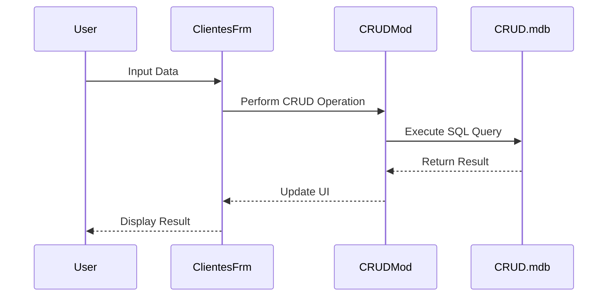

## Documentation for VB6 CRUD Application

### Purpose
The VB6 CRUD application is designed to manage customer data through a graphical user interface. It provides basic Create, Read, Update, and Delete (CRUD) operations on a database of customer records. The application is built using Visual Basic 6 (VB6) and interacts with a Microsoft Access database (`CRUD.mdb`) to store and retrieve customer information.

### Key Modules

1. **ClientesFrm.frm (1231 lines)**
   - **Purpose**: This is the main form of the application where users can perform CRUD operations on customer data.
   - **Features**: 
     - Display customer records.
     - Input fields for adding or updating customer information.
     - Buttons for creating, updating, deleting, and searching records.

2. **CRUDMod.bas (463 lines)**
   - **Purpose**: Contains core logic for CRUD operations.
   - **Features**: 
     - Functions for connecting to the database.
     - Methods for executing SQL queries to perform insert, update, delete, and select operations.

3. **BuscarFrm.frm (342 lines)**
   - **Purpose**: A form dedicated to searching customer records.
   - **Features**: 
     - Input fields for search criteria.
     - Display of search results.

4. **TextBoxesMod.bas (312 lines)**
   - **Purpose**: Provides utility functions for handling text box inputs.
   - **Features**: 
     - Validation of text box data.
     - Formatting and clearing text box fields.

5. **GeneralMod.bas (63 lines)**
   - **Purpose**: Contains general utility functions used across the application.
   - **Features**: 
     - Common helper functions for string manipulation and other general tasks.

6. **HelpersMod.bas (57 lines)**
   - **Purpose**: Additional helper functions to support application functionality.
   - **Features**: 
     - Miscellaneous utility functions.

### Dependencies
- **VB6 Runtime**: The application is built using Visual Basic 6, requiring the VB6 runtime environment.
- **Microsoft Access Database**: The application uses `CRUD.mdb` as its database, which requires Microsoft Access or compatible drivers for database operations.

### Mermaid Diagrams

#### Application Flow

#### CRUD Operations

This documentation provides an overview of the VB6 CRUD application, its key components, dependencies, and the flow of operations within the system.