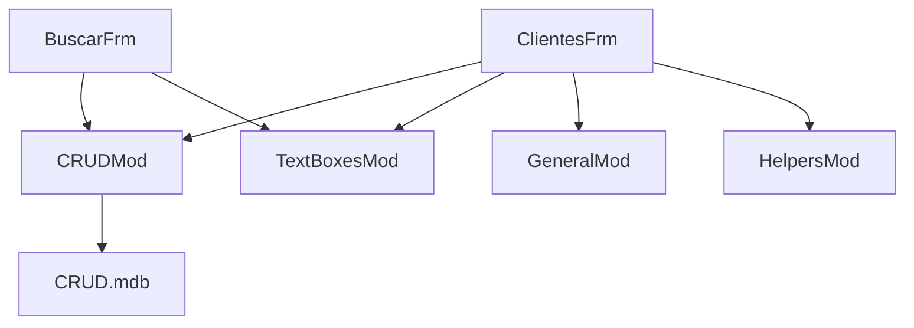

### Documentation for VB6 Form Code

#### Purpose
The VB6 application is designed to perform CRUD (Create, Read, Update, Delete) operations on a database of clients. The primary form, `ClientesFrm.frm`, serves as the main interface for interacting with the client data. It allows users to add new clients, view existing client details, update client information, and delete clients from the database.

#### Key Modules
1. **ClientesFrm.frm**: 
   - This is the main form of the application, containing the user interface for client management.
   - It includes various controls such as text boxes, buttons, and grids to facilitate user interaction.
   - Handles events related to CRUD operations and updates the UI accordingly.

2. **CRUDMod.bas**:
   - Contains the core logic for performing CRUD operations.
   - Interacts with the database to execute SQL queries for data manipulation.
   - Provides functions that are called by the form to perform database operations.

3. **BuscarFrm.frm**:
   - A secondary form used for searching clients within the database.
   - Provides a user interface for entering search criteria and displaying search results.

4. **TextBoxesMod.bas**:
   - Contains utility functions related to text box controls.
   - Includes validation and formatting functions to ensure data integrity.

5. **GeneralMod.bas**:
   - Provides general utility functions that are used across the application.
   - Includes functions for error handling and other common tasks.

6. **HelpersMod.bas**:
   - Contains helper functions to support various operations within the application.
   - These functions are typically used to simplify repetitive tasks.

#### Dependencies
- **Database**: The application relies on a Microsoft Access database (`CRUD.mdb`) to store and manage client data.
- **VB6 Runtime**: Requires the Visual Basic 6 runtime environment to execute the application.
- **External Libraries**: May depend on additional VB6 libraries for database connectivity and UI components.

#### Class Diagram
A class diagram is not directly applicable to VB6 forms, as VB6 is not object-oriented in the same way as modern languages. However, a conceptual diagram can be created to show the relationships between forms and modules.

#### Mermaid Diagram
Below is a simplified Mermaid diagram representing the interaction between the main components of the application:

This diagram illustrates how the main form (`ClientesFrm`) interacts with various modules to perform its functions, and how these modules interact with the database. The `BuscarFrm` form also interacts with some of these modules for search functionality.