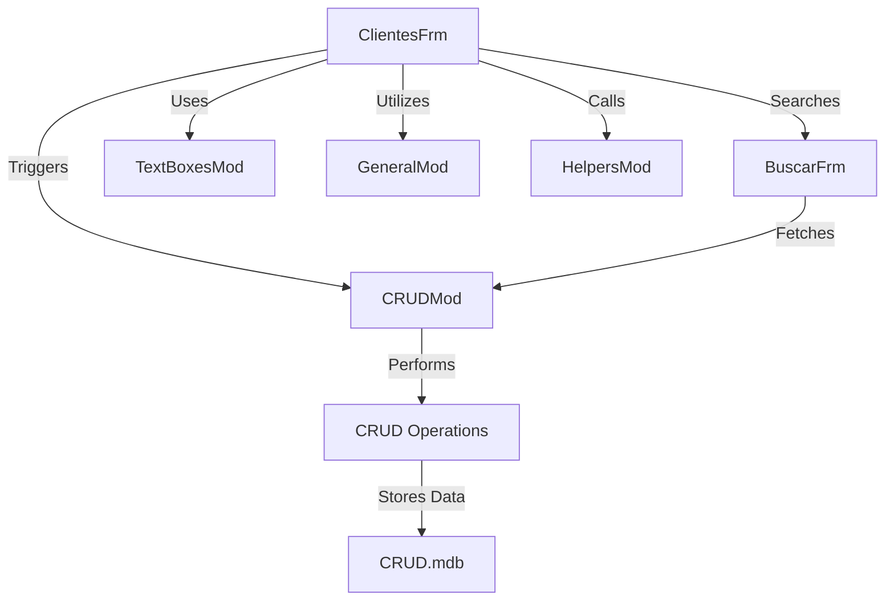

### VB6 CRUD Application Documentation

#### Purpose
The VB6 CRUD application is designed to manage customer data through a graphical user interface. It provides basic Create, Read, Update, and Delete (CRUD) operations on a customer database. The application is likely used for small to medium-sized businesses to maintain customer records efficiently.

#### Key Modules

1. **ClientesFrm.frm**
   - **Type**: VB6 Form
   - **Lines of Code**: 1231
   - **Description**: This is the main form of the application, responsible for displaying and managing customer data. It includes UI components for user interaction, such as text boxes, buttons, and data grids. The form handles user inputs and triggers CRUD operations.

2. **CRUDMod.bas**
   - **Type**: VB6 Module
   - **Lines of Code**: 463
   - **Description**: This module contains the core logic for CRUD operations. It interfaces with the database to perform insert, update, delete, and select operations. It likely includes functions for connecting to the database and executing SQL queries.

3. **BuscarFrm.frm**
   - **Type**: VB6 Form
   - **Lines of Code**: 342
   - **Description**: This form is used for searching customer records. It provides a user interface for entering search criteria and displaying search results. It interacts with the CRUDMod module to fetch data based on user input.

4. **TextBoxesMod.bas**
   - **Type**: VB6 Module
   - **Lines of Code**: 312
   - **Description**: This module likely contains utility functions for managing text box inputs across the application. It may include validation routines and helper functions to streamline data entry and ensure data integrity.

5. **GeneralMod.bas**
   - **Type**: VB6 Module
   - **Lines of Code**: 63
   - **Description**: This module contains general-purpose functions and constants used throughout the application. It may include configuration settings, error handling routines, and other utility functions.

6. **HelpersMod.bas**
   - **Type**: VB6 Module
   - **Lines of Code**: 57
   - **Description**: This module provides additional helper functions that support the main application logic. It may include functions for formatting data, handling dates, or other common tasks.

#### Dependencies

- **CRUD.mdb**: This is the Microsoft Access database file that stores customer data. The application depends on this file for all data storage and retrieval operations.
- **VB6 Runtime**: The application requires the VB6 runtime environment to execute, as it is developed using Visual Basic 6.

#### Mermaid Diagrams

Below is a high-level flowchart representing the interaction between the main components of the application:

This diagram illustrates how the main form (`ClientesFrm`) interacts with the CRUD module to perform database operations, how the search form (`BuscarFrm`) is used for querying data, and how various utility modules support the overall functionality.